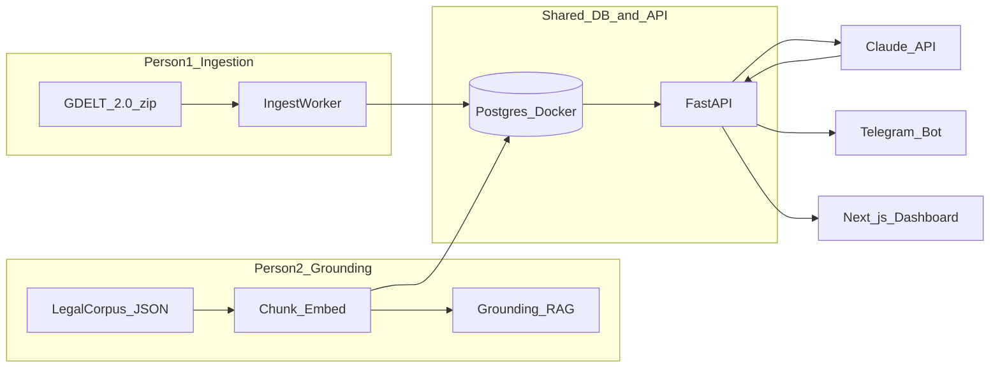

# Al-Ansar One-Day Hackathon Demo Plan

## Goal and judge story (Leverage)

**Pitch:** When a crisis affecting Muslims is detected (e.g. discrimination, mosque restrictions, deportation risk in Finland/EU), Al-Ansar does not stop at awareness. It (1) grounds the situation in **real public law** with citations, (2) identifies **legitimate response routes** (legal aid, ombudsman, FOI, parliamentary contact), (3) decomposes work into tasks, and (4) routes tasks to skilled **Ansar** helpers — demoed via Telegram alerts.

This maps directly to Diwan Track 2 **Leverage**: *"connect people to real and legitimate ways that public institutions can be asked, answered, or held to account."*

---

## Architecture (local, one machine)



**Stack (minimal):**
- **Postgres 16 + pgvector** in Docker (local)
- **FastAPI** (Python 3.12) — single service for ingest, grounding, matching, notifications
- **Next.js 14** — read-only dashboard (crisis card, legal grounding panel, task Kanban, top matches)
- **Claude API** — crisis extraction, grounding synthesis, task decomposition (structured JSON outputs)
- **Telegram Bot API** — notifications ([docs](https://core.telegram.org/bots/api/))

Skip Celery/Redis for day 1; use a **manual trigger script** + optional `APScheduler` hourly stub.

---

## Verified grounding resources (use only these for demo corpus)

Pre-download and chunk **15–25 documents** (not live-scraping at demo time). Every grounding claim must cite `source_id` + URL.

| Layer | Resource | Why for demo | Official source |
|-------|----------|--------------|-----------------|
| EU employment | Council Directive **2000/78/EC** (religion/belief in employment) | Hijab/workplace, hiring discrimination | [EC Employment Equality page](https://employment-social-affairs.ec.europa.eu/policies-and-activities/rights-work/tackling-discrimination-work/legislation-employment-equality-directive-200078ec_en) |
| EU legislation API | **EUR-Lex CELLAR SPARQL** | Fetch CELEX text/metadata programmatically | [CELLAR SPARQL endpoint](https://publications.europa.eu/webapi/rdf/sparql), [EUR-Lex reuse guide](https://eur-lex.europa.eu/content/help/data-reuse/reuse-contents-eurlex-details.html?locale=en) |
| Finland national | **Non-Discrimination Act 1325/2014** (religion as protected ground) | Host-country law for Helsinki demo | [Finlex English PDF](https://www.finlex.fi/api/media/statute-foreign-language-translation/687912/mainPdf/main.pdf) |
| ECHR | **HUDOC** Article 9 case law + Art. 9 guide | Religious freedom precedents | [HUDOC](https://hudoc.echr.coe.int/), [Art. 9 guide](https://ks.echr.coe.int/documents/d/echr-ks/guide_art_9_eng) |
| Evidence base | FRA **Being Muslim in the EU** (2024) + **Anti-Muslim Hatred Database** | Quantify harm; Finland 63% discrimination stat supports urgency | [Being Muslim report](https://fra.europa.eu/pl/publication/2024/being-muslim-eu), [AMH database](https://fra.europa.eu/es/project/2025/database-anti-muslim-hatred-2018-2024) |
| Leverage routes | **FragDenStaat API** (FOI pattern), Finland **Eduskunta** open data (MP questions) | Action routes in Leverage story | [FragDenStaat API](https://fragdenstaat.de/en/api/), [avoindata.eduskunta.fi](https://avoindata.eduskunta.fi/#/fi/home) |
| Optional helper lib | `cellar-extractor`, `echr-extractor` | Weekend-friendly ingestion scripts | [cellar-extractor](https://pypi.org/project/cellar-extractor/), [echr-extractor](https://pypi.org/project/echr-extractor/) |

**Recommended demo jurisdiction:** Finland event + EU law overlay (hackathon host + FRA Finland data).

**Seed crisis scenario (if GDELT filter is thin):** workplace religious discrimination in Helsinki — aligns with FRA findings and Directive 2000/78 / Yhdenvertaisuuslaki.

---

## Shared database schema (contract for integration)

Both people implement against this schema in [`/Users/farouq/projects/al_ansar`](/Users/farouq/projects/al_ansar):

```sql
-- Person 1
crisis_objects(id, title, summary, type, country_iso, lat, lng, severity, urgency, tags[], raw_gdelt_id, created_at)

-- Person 2
legal_sources(id, title, jurisdiction, source_type, url, celex_or_ref)
legal_chunks(id, source_id, chunk_text, embedding vector(1024))  -- optional for day 1
grounding_results(id, crisis_id, has_legal_support bool, summary, citations jsonb, leverage_routes jsonb)

-- Joint
tasks(id, crisis_id, title, description, required_skills[], task_type, status)
ansar_users(id, name, skills[], lat, lng, languages[], trust_tier, capacity, telegram_chat_id)
matches(id, task_id, ansar_id, score, rank, notified_at)
notifications(id, match_id, channel, status, payload)
```

**Integration API surface (FastAPI):**
- `POST /ingest/gdelt` — Person 1
- `POST /ground/{crisis_id}` — Person 2
- `POST /pipeline/run/{crisis_id}` — chains ground → decompose → match (integration checkpoint)
- `GET /dashboard/*` — UI reads

**Shared controlled vocabulary** (must match between tasks and Ansar): `legal_aid`, `advocacy`, `translation`, `remote_research`, `foi_request`, `psychological_support`, `logistics`, `fundraising`, `medical_triage`, `on_ground_aid`.

---

## Hour-by-hour schedule (two people, ~8–10h)

### Hour 0–1 — Joint setup (both)
- Init monorepo: `backend/`, `frontend/`, `docker-compose.yml` (Postgres + pgvector), `.env.example`
- Apply schema migrations (Alembic or single `schema.sql`)
- Agree on **one seed crisis JSON** shape and sample payload
- Create Telegram bot via BotFather; store `TELEGRAM_BOT_TOKEN` in `.env`

### Hours 1–4 — Parallel tracks

#### Person 1: Data ingestion ([`initial_jottings.md`](initial_jottings.md) items 1, flow step 1)

1. **GDELT fetch script** (`backend/ingest/gdelt.py`):
   - Poll [GDELT 2.0 lastupdate.txt](http://data.gdeltproject.org/gdeltv2/lastupdate.txt) for latest `.export.CSV.zip` ([GDELT data docs](https://www.gdeltproject.org/data.html))
   - Parse tab-delimited export; filter rows where `ActionGeo_CountryCode == 'FI'` OR `V2Themes` contains `RELIGION`, `MUSLIM`, `DISCRIMINATION`, `REFUGEE`
   - For hackathon speed: **also ship `seed_crisis.json`** — one pre-selected row if live filter returns noise

2. **Crisis extraction** (`backend/services/crisis_parser.py`):
   - Claude structured output → `CrisisObject` (type, location, severity 1–5, tags from controlled vocab)
   - Insert into `crisis_objects`

3. **Deliverable for integration:** `POST /ingest/gdelt` returns `crisis_id`; DB has ≥1 crisis with `severity >= 3`

#### Person 2: Grounding store ([`initial_jottings.md`](initial_jottings.md) items 2–3, flow step 2–3)

1. **Corpus builder** (`backend/grounding/build_corpus.py`):
   - Download/cache: Finlex PDF, EU directive text (via CELLAR REST or static copy), 3–5 HUDOC Art. 9 cases (use `echr-extractor` or manual HTML), FRA report executive summary (PDF/HTML)
   - Split into ~500-token chunks; store in `legal_sources` + `legal_chunks` with metadata (`jurisdiction`, `topic_tags`)

2. **Retrieval** (`backend/grounding/retrieve.py`):
   - Day-1 MVP: **keyword + jurisdiction filter** (Finland/EU) → top 8 chunks
   - Stretch: pgvector cosine on chunk embeddings (Voyage or `text-embedding-3-small`)

3. **Grounding agent** (`backend/grounding/ground.py`):
   - Input: crisis summary + retrieved chunks
   - Claude prompt rules: **every claim must cite `source_id` + URL**; if insufficient evidence, say so
   - Output `grounding_results`:
     - `has_legal_support`: true if relevant anti-discrimination / religious freedom protections apply
     - `citations`: `[{source, excerpt, url}]`
     - `leverage_routes`: `[{route_type: "ombudsman"|"tribunal"|"foi"|"mp_question"|"legal_aid", body, url, template_action}]` — map to FragDenStaat / Eduskunta / Finnish Non-Discrimination Ombudsman patterns

4. **Deliverable for integration:** `POST /ground/{crisis_id}` returns grounding JSON with ≥2 citations from real stored sources

### Hour 4 — Integration checkpoint (both, 30–45 min)

Wire pipeline in `backend/services/pipeline.py`:

```
crisis_id → ground() → if has_legal_support → decompose() → insert tasks
```

**Gate:** If `has_legal_support == false`, still create tasks but flag `legal_review_needed` (do not silently hallucinate protections).

Person 1 exposes crisis; Person 2 consumes `crisis_objects.summary` + `country_iso`.

### Hours 4–7 — Joint: synthetic users, matcher, notifications

#### 4. Synthetic Ansar population ([`initial_jottings.md`](initial_jottings.md) items 3–4)

- Script `backend/seed/ansar_generator.py`: 50 users with varied:
  - `skills[]` from controlled vocab (ensure coverage: ≥5 `legal_aid`, ≥5 `foi_request`, ≥5 `translation`, etc.)
  - Locations: cluster in Finland (Helsinki, Tampere) + diaspora EU cities
  - `trust_tier`: mostly `org_verified` for demo credibility
  - `telegram_chat_id`: team members' real IDs for live demo; others use placeholder

#### 5. Task decomposition (flow step 4)

- `backend/services/decomposer.py`: Claude takes crisis + grounding + leverage_routes → 3–6 `TaskObject`s
- Each task: `required_skills[]`, `task_type`, link to a `leverage_route` where applicable (e.g. FOI task → `foi_request` skill)

#### 6. Matcher (flow step 5–6)

Two-pass (simplified from jottings):

1. **Hard filter:** `skills && required_skills` overlap + `ST_DWithin` 500km (or same country for remote tasks)
2. **Score:** `0.7 * skill_overlap + 0.3 * trust_tier_weight` (skip pgvector rerank unless time)

Top 3 per task → `matches` table.

#### 7. Notifications

- `backend/services/notify.py`: Telegram `sendMessage` ([API](https://core.telegram.org/bots/api#sendmessage))
- Message template: crisis title, task, why matched (skills), **legal citation snippet**, leverage route CTA link
- Log to `notifications` table

### Hours 7–9 — Dashboard + demo polish

**Next.js pages** (`frontend/`):
- `/` — crisis map/list (single crisis OK)
- `/crisis/[id]` — grounding panel with clickable citations
- `/tasks` — Kanban: Open → Matched → Notified
- `/ansar` — directory with skills badges

**Demo script (3 min):**
1. Trigger ingest (or show pre-seeded crisis)
2. Run pipeline → show grounding with EU/Finland citations
3. Show tasks derived from leverage routes
4. Show matcher results → send Telegram to phone live
5. Close: *"This is Leverage — from crisis to legitimate institutional action, routed to verified helpers."*

---

## Anti-hallucination rules (critical for judges)

1. **No free-text law** in UI — only chunks from `legal_chunks` table
2. Claude grounding prompt: *"Use ONLY provided chunks; cite source_id and URL; if unsure, respond INSUFFICIENT_EVIDENCE"*
3. Store `grounding_results.citations` as structured JSON, render verbatim in dashboard
4. Leverage routes must use URLs from corpus metadata (ombudsman, Finlex, FragDenStaat, Eduskunta) — not invented portals

---

## Repo layout to create

```
al_ansar/
├── docker-compose.yml          # postgres:16 + pgvector
├── backend/
│   ├── main.py                 # FastAPI app
│   ├── ingest/gdelt.py
│   ├── grounding/{build_corpus,retrieve,ground}.py
│   ├── services/{crisis_parser,decomposer,pipeline,matcher,notify}.py
│   ├── seed/{ansar_generator,seed_crisis.json}
│   └── db/schema.sql
├── frontend/                   # Next.js 14
└── scripts/demo.sh             # one-command demo run
```

---

## Risks and mitigations

| Risk | Mitigation |
|------|------------|
| GDELT noise / no Finland Muslim event today | Ship `seed_crisis.json` from recent export; live ingest as bonus |
| CELLAR SPARQL complexity | Pre-download directive + Finlex PDF Friday night; SPARQL optional |
| Grounding hallucination | Retrieval-only citations; structured output validation |
| Telegram delivery | Pre-register chat IDs; test `/start` with bot before demo |
| Time overrun | Drop pgvector rerank, Mapbox, hourly worker — keep pipeline button |

---

## Definition of done (working demo)

- [ ] 1 crisis in DB (GDELT or seed)
- [ ] Grounding returns ≥2 real citations (EU + Finland)
- [ ] ≥1 leverage route with real URL
- [ ] 3–6 tasks created after decomposition
- [ ] 50 Ansar users seeded
- [ ] Top matches per task visible in dashboard
- [ ] ≥1 Telegram notification sent successfully
- [ ] End-to-end runnable via `scripts/demo.sh` on one laptop
